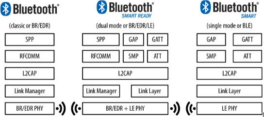
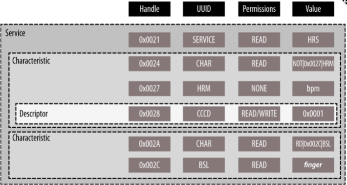
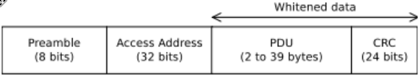
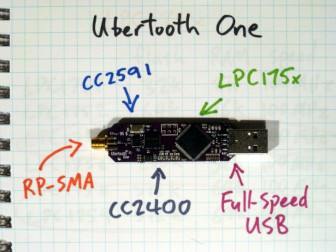
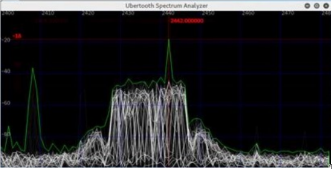
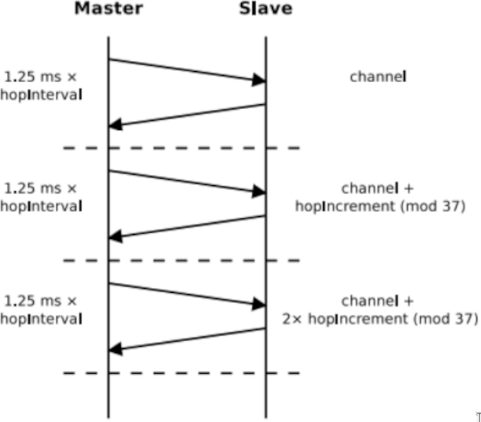
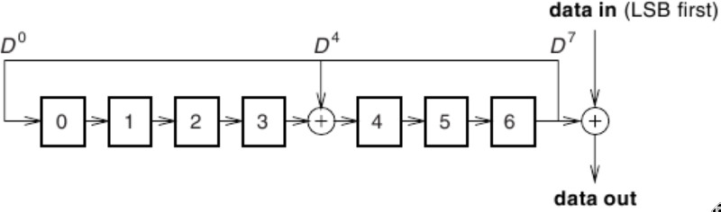

\pagebreak

# Glossary

| Term      | Meaning                                                                                                                                                                                |
| --------- | -------------------------------------------------------------------------------------------------------------------------------------------------------------------------------------- |
| BLE       | Bluetooth Low Energy, a standards-based radio specification for short range, low power connectivity protocols                                                                          |
| CRC       | Cyclic Redundancy Check, a code used to detect accidental changes (corruption) to raw data                                                                                             |
| GAP       | Generic Access Profile, in Bluetooth, used to control connections and advertising                                                                                                      |
| GATT      | Generic Attribute Profile, in Bluetooth Low Energy, defines the way that two devices transfer data back and forth using concepts called Services and Characteristics                   |
| GFSK      | Gaussian Frequency Shift Keying, a type of signal modulation which uses a Gaussian filter to shape the pulses before they are modulated                                                |
| ISM       | A subset of the radio spectrum reserved internationally for Industrial, Scientific and Medical purposes, excluding applications in telecommunications                                  |
| IV        | Initialisation Vector, an input to a cryptographic primitive being used to provide the initial state                                                                                   |
| LFSR      | Linear Feedback Shift Register, a shift register whose input bit is a linear function of its previous state                                                                            |
| MITM      | Man in the Middle attack, when an attacker secretly relays and possibly alters the communications between two parties who believe that they are directly communicating with each other |
| Nonce     | Synonymous with Initial Vector                                                                                                                                                         |
| SoC       | System on a Chip, an integrated circuit that integrates all components of a computer system                                                                                            |
| Whitening | The process of scrambling of Bluetooth packets                                                                                                                                         |

\pagebreak

# Introduction

Bluetooth Low Energy (BLE for short) specifically, also known as “Bluetooth Smart” under its marketing label, is one of the most vastly deployed short range, low power connectivity protocols on the planet, estimated to be in use on over 24 billion devices (Ryan, 2013).

BLE emerged as skunk works project “wibree” at Nokia back in 2009, before being taken on by the Bluetooth Special Interest Group (SIG) as a subset of the overall “4.0 core specification”.



Key design opinions of BLE were to establish a radio standard and protocol suite with the lowest power consumption possible by optimising for low cost, low bandwidth, low power and low complexity (@townsend2014getting). It is not unreasonable, for example, to expect a BLE SoC solution to operate for several months off a single coin cell battery.

BLE reached the public market as a published standard in June 2010 in version 4.0 of the Bluetooth Core Specification. BLE has since seen phenomenal adoption and growth mostly due to timing and close ties to the smartphone and mobile computing sectors, which was born around this timeframe. Other factors driving BLE’s success, include active commitment by industry giants such as Samsung and Apple, mature manufacturing pipelines with complete BLE system-on-a-chip (SoC) solutions available for under $2 USD, and the simple fact that BLE is such an extensible protocol for exchanging arbitrary data. This sets BLE apart from other radio standards such as GSM, Zigbee or even Bluetooth Classic.

## The application layers

The Bluetooth core specification makes clear delineation between protocols and profiles, with a protocol being the core building blocks upon which all conformant devices use (such as encoders, decoders, packet assembly, routing), and profiles define how protocols can be tied together to achieve an end-to-end goal, such as the standard “Glucose Profile” in the application of secure blood monitoring.

Profiles however do not have to meet a specific use-case, this is where generic profiles play a key role. Generic profiles assemble protocol stacks to solve a range of common device independent problems such as a standard scheme for broadcasting arbitrary data between devices, a way to do inter-device discovery, connection management, security negotiation and so on. The specification defines two generic profiles Generic Access Profile (GAP) and Generic Attribute Profile (GATT).

Generic Access Profile (GAP) is in essence BLE’s upper control layer, deals with the underpinning low level radio protocols to build the high-level concepts of modes and roles, that enable devices to broadcast between each other, manage stateful connections, engage in device discovery, and negotiate security between each other (Generic Access Profile Specification, 2021). GAP is non-negotiable when it comes to BLE, all “BLE compatible devices” must comply.

If GAP is the control layer, then Generic Attribute Profile (or GATT) can be thought of as the data exchange layer. GATT comes into play once an exclusive connection is established between two devices and defines the layout of the data and specific operations for discovering, reading, writing and pushing data elements between devices (@gattspec), and is based on the following concepts:

-   Attribute: defines the shape of a piece of data (e.g. a heart rate measurement)
-   Characteristic: a container for user data, that always includes at least two attributes: the characteristic declaration (metadata about the data) and the characteristic value (the actual user data in its value field). For example, the SIG standardised “Battery Level” characteristic represents the remaining power level of a battery in a device
-   Service: a grouping of one or more Attributes or Characteristics. For example, the SIG standardised “Battery Service” contains a Characteristic called the “Battery Level” (@gattspec)

As can be seen in Figure 2, a heart rate service exposes characteristics of a “Heart Rate Measurement” (HRM) and a “Body Sensor Location” (BSL), in a very explicit manner, using SIG pre-defined 16-bit code scheme. This is essential in low-power applications where wasteful communication cannot be tolerated.



## The physical layers

At the physical layer BLE operates in the unlicensed 2.4 GHz Industrial, Scientific and Medical (ISM) spectrum. Unlike predecessor Bluetooth technologies, BLE makes power consumption focused tradeoffs, such as reduced channel hopping rates and timing parameters. For these reasons BLE is physically (at the RF level) incompatible with Bluetooth Classic which also operates in the 2.4 GHz ISM frequency band.

BLE by using Gaussian Frequency Shift Keying (GFSK) scheme, can transmit up to 1 Mbit/second on one of 40 possible channels. 37 channels are pegged as data channels, and the remaining 3 “advertising channels'' are dedicated to the task of handling broadcast metadata from unconnected master and slave devices.

The anatomy of a BLE packet:

-   Preamble: an 8-bit sequence number
-   Access Address (AA)
    -   In data mode is a 32-bit connection identifier that is communicated from the master device to the slave device during connection setup
    -   In advertising mode is a fixed value of 0x8e89bed6
-   Protocol Data Unit (PDU): is a variable length (2-39 bytes) message payload
-   Cyclic redundancy check (CRC): 24-bit error detection code



# Body

Given the design trade-offs made by Bluetooth Low Energy to achieve a radio platform and protocol that is low power consumption and low cost, is the result of several design simplifications, to the whitening seed, to key exchange to cater for smaller input, channel hopping frequency, radio timing parameters, over predecessor Bluetooth specifications (@townsend2014getting).

These design simplifications lower the bar when it comes to security, easing the task of performing eavesdropping for example, and a significantly more primitive key exchange protocol to meet low power computing devices (@ryan2013bluetooth). While these trade-offs make sense in the context of low power devices, they greatly undermine the confidentiality of the system.

In practice Wi-Fi (i.e. the 802.11 family of protocols) is relatively trivial to eavesdrop in comparison to Bluetooth (and BLE), which present the additional challenges of filtering out only the packets that relate to a connection of interest, dealing with high speed channel hopping (i.e. determining hop internal and increment), CRC recalculation, determining the boundary of a transmission using a known access address (AA) and de-scrambling the header and body data referred to as “whitened data”.

## Challenge 1: Hardware

Several hardware platforms exist to build a Bluetooth sniffer upon. One popular option in the security research community is the Ubertooth platform due to its open and extensible architecture (@cope2017investigation).



The LPC175x is a microcontroller that features a single 32-bit ARM processor core, static RAM and flash memory, and in the case of simpler BLE protocol, is powerful enough to process BLE RF bitstream directly from the 2.4 GHz CC2400 transceiver chip in real time, that is, without needing to hand over the bitstream to the main host machines processor.

Avoiding this costly I/O, makes it feasible to build a low-latency high precision radio sniffer that is needed to recover the fine hop interval and hop increment calibrations used broadly by Bluetooth, including Bluetooth Low Energy.

## Challenge 2: BLE connections

When a BLE device transmits it generates RF energy, as visualised by the Ubertooth spectrum analyser in Figure 5.



Demodulating the radio signal into binary (i.e. bits), is possible if the CC2400 radio chip is configured in-line with the Bluetooth Low Energy parameters for its Gaussian Frequency Shift Keying (GFSK) modulation scheme with a data rate of 1 Mbit and an offset of 250 kHz. To determine the boundary of a transmission, a known 32-bit access address (AA) is needed (see Challenge 4: Sniffing the Access Address below). The bits can then be laid out and parsed as well-formed packets as per the specification.

Now packets can be reassembled, the next problem is around the way BLE uses channels; using a hopping pattern that is agreed between client and server:



When the BLE connection is first established between master and slave devices, a hop_interval and hop_increment are agreed upon.

Luckily the BLE hopping pattern algorithm is simplistic. Given there are 37 total data channels at a connection’s disposal, the next channel to hop to is calculated as follows:

```
next_channel = (current_channel + hop_increment) % 37
```

The master and slave, after waiting for the exact same time period (1.25ms x hop_interval), both “hop” to the next channel in lockstep. To trace a BLE connection, it is essential the sniffer can follow along the same “channel hop pattern”.

An approach for reversing engineering these parameters, will be considered later in this paper.

## Challenge 3: Unsrambling "whitened" data

In Bluetooth Low Energy all sent packets are “whitened” (scrambled) as per the specification, by washing each byte of packet data through an XOR with the output of a linear-feedback shift register (LFSR) as follows:



The initial seed (IV) for the shift register (LFSR), unlike Bluetooth classic which provides a pseudo-random value by using the lower 6-bits of the clock, Bluetooth Low Energy simply sets the seed value to the current hop channel number.

Given the configuration of the Linear Feedback Shift Register and the initial seed (IV) are known, makes it a trivial exercise to decrypt (un-whiten) the data.

## Challenge 4: Sniffing the Access Address (AA)

When the device is in data-mode, this address is a 32-bit connection identifier that is communicated from the master device to the slave device during connection setup. When in advertising mode is a fixed value of 0x8e89bed6.

The BLE specification states that master and slave must transmit a packet to each channel they hop along to. In practice hops occur so frequently, that there is often no data that needs to be transmitted, and in this case empty packets (with headers only) are sent. The signature of an empty data packet is obvious; within the PDU segment of the packet, a 16-bit header with its flow control bits set to zero, followed by a 24-bit CRC.

The sniffer can therefore select an assortment of channels to observe and easily identify this bit pattern when it occurs, extracting the access address (AA) from the empty data packets.

## Challenge 5: Recovering the checksum

The ability to accurately recalculate the CRC (Cyclic Redundancy Check) is critical, as this will confirm if the correct channel hop increment and hop interval parameters have been selected. Given these parameters are highly sensitive to timing, this issue must be tackled first, before determining the correct hop parameters.

Like the data whitening encoding, the BLE specification makes use of a 24-bit Linear Feedback Shift Register (LFSR) for the CRC. The 24-bit seed value for this shift register is initialised when a connection is established and varies between connections.

In older security research into Bluetooth classic, Spill (2008) discovered the configuration of the Linear Feedback Shift Register (LFSR) used to calculate a classic Bluetooth CRC is reversible.

By assembling a Linear Feedback Shift Register in reverse of the original, each bit from an actual eavesdropped CRC, can be washed through the reverse LFSR, bit by bit, until all 24-bits have been pushed through. The value that remains will be the original seed value (i.e. the initialisation vector) configured in the connection-specific CRC LFSR.

## Challenge 6: Determining the channel hop interval

As described in the section Challenge 2: Connections, as per the BLE specification, the master and slave devices, after waiting the exact same period of time (1.25ms x `hop_interval`), will both “hop” to the next channel. It is critical this occurs in lockstep.

In order to eavesdrop on a BLE connection, it is essential the sniffer can follow along the same “channel hop beat of the drum” defined by this hop interval. Recall the `hop_interval` is a variable that is set during connection establishment and is multiplied by 1.25ms.

By observing the connection traffic on one specific data channel (e.g. channel 1) out of the 37 available data channels, and measuring the roundtrip time between consecutive packets, it is possible to infer the `hop_interval` parameter using the following formula (@ossmann2009building):

```
hop_interval = time_between_packets / 37 × 1.25 ms
```

A working example, if the time measure between consecutive packets on data channel 1 is 4625 ms:

```
hop_interval = 4625 / 37 × 1.25
hop_interval = 46.25
```

The `hop_interval` parameter, in this case 46.25 is multiplied by the specification base time period of 1.25 milliseconds. The hop time period (aka dwell time) therefore in the above example is:

```
hop_time_ms = 46.25 × 1.25
hop_time_ms = 51.8125
```

51.8125 milliseconds dwell time, between each channel hop.

## Challenge 7: Determining the channel hop increment

As described in the section _Challenge 2: Tracing a BLE Connection_, as per the BLE specification, as part of making a connection between a master and slave device, a `hop_increment` (like the `hop_interval`) is a variable that is agreed upon when the connection is first established, and defines the number of channels to hop over at each time period, based on the following formula:

```
next_channel = (current_channel + hop_increment) % 37
```

Given the `hop_interval` parameter is now a known quantity (in section _Challenge 6: Determining the Channel Hop Interval_), Ryan (2013) observes that by measuring the “inter-channel arrival time” of packets on two different data channels, it is possible to infer the number of channels hopped.

Concretely by measuring the time it takes for a packet to arrive on channel 1 gives time measurement t1. Once t1 is recorded, the sniffer must immediately switch over to the next channel (i.e. channel 2) and observe the time it takes for another packet to arrive, time measurement t2.

t2 - t1 gives the inter-channel arrival time.

```
channels_hopped = interarrival_time_ms / (1.25 × hop_interval)
```

Following the working example from _Challenge 6: Determining the Channel Hop Interval_, a `hop_interval` of 46.25 ms was measured.

If an inter-channel packet arrival time (i.e. the time period for different packets to arrive on different channels) of 1445.3125 milliseconds was measured, then the total number of channels hopped can be calculated as follows:

```
channels_hopped = 1445.3125 / (1.25 × 46.25)
channels_hopped = 25
```

Given the total number of channels hopped is now known, the following equation is expected to always be true, in the case that the two channels being observed sit directly next to one another (e.g. such as channel 1 and 2, or channel 35 and 36, and so on):

```
hop_increment × channels_hopped = 1 (mod 37)
```

Concretely, that is the total number of channels hopped between two consecutive channels, will always be one greater than the modulus of the total number of available data channels (37 in the case of BLE).

Continuing the working example, above, when the total number of channels hopped was found to be 25:

```
hop_increment × 25 = 1 (mod 37)
```

This is a modular multiplicative inverse problem (@mmi), to which there are many elegant mathematical solutions. The simplest being a brute force of all numbers between 1 and 37, checking what equals 1.

The Bluetooth designers have picked the number of available data channels as 37, due to its prime-ness (only divisible by 1 and itself). The property of being a prime number is relevant here, as it opens up “Fermat’s little theorem” to solve the modular multiplicative inverse. Reworking the original, to use the Extended Euclidean algorithm:

```
channels_hopped-1 = 1 (mod 37)
25 × 3 = 75
75 (mod 37) = 1
25-1 = 3 (mod 37)
```

Can see given 25 channels were hopped over, and the `hop_increment` was calculated to be 3.

Optimising using Fermat’s little theorem, the `hop_increment` can be derived as follows:

```
channels_hopped^-1  = channels_hopped^37-2 (mod 37)
25-1 = 2537-2 (mod 37)
```

Given that these are only going to be 36 possible values for `hop_increment`, these can be pre-calculated and looked up on demand (i.e. cached).

## Defeating the encryption

Bluetooth Low Energy features baked-in encryption and supporting key exchange protocols.

"The designers’ stated goal was to protect against eavesdropping and man-in-the-middle attacks; see Section 5.3 of vol 1 of the specification. In order to do this, the pairing protocol is based on Elliptic curve Diffie-Hellman key exchange. This direction is very positive and shows that the security of Bluetooth was considered seriously." (@lindell2008attacks)

Unlike Bluetooth classic which leverages ECDH key exchange, the SIG simplified the key exchange protocol when it comes to Bluetooth Low Energy, by inventing a simpler variation of it. At the time of writing, the encryption ciphers employed by BLE, AES-CCM are known to be reliable (@whiting2003rfc3610).

Lindell (2008) shows that it is possible to brute force a given key exchange protocol, if all components of the key exchange are transmitted in cleartext, which they are in the case of BLE.

If an encryption key has not already been established between master and slave devices, then one is established by initiating a “key exchange”.

The key exchange starts by setting up a temporary key, in the case of BLE, a 128-bit AES key, the value of which depends on the pairing mode:

-   Just Works: 0
-   6-digit PIN: a value between 0 and 999,999
-   Out of Band: 128-bit value that is not exchanged over the same 2.4 Ghz baseband used by BLE, but over other mediums such as NFC

In the case of Just Works and 6-digit PIN, using naive brute force, it is possible to calculate the “confirm value” for every possible temporary key between 0 and 999,999; using this approach Ryan (2013) discovered that a temporary key is crackable in under a second on low-cost computer hardware. Like an onion, the temporary key is used to create a short-term key, which is used in turn to create a long-term key.

While the above is not effective for well-chosen OOB keys, in practice most BLE use-cases leverage Just Works and/or 6-digit PIN pairing methods to cater for the simplest of consumers. In my research I could not find any consumer grade devices that provide the Out-of-Band method of key exchange.

Tools such as crackle automate the analysis of BLE key exchange and encrypted sessions offline (@crackle). Given that encryption keys are reused long term, across numerous sessions, increase the value proposition of mining and later reusing cracked keys against the same target over time.

## Injection and Jamming

The Bluetooth specification has provisions for broadcasting and forcing key renewals. Both provide opportunities for misuse.

The ingredients needed to craft a BLE undirected advertising packet are an advertising address (AA) in the form of a user-specified MAC address to spoof as a fake device, an overall packet CRC, and the whitening of the data. To the protocol, and to other devices these packets would appear to be legimate.

Given the parameters of the channel hopping sequence can be identified using techniques laid out in this paper, a simplistic jammer using the Ubertooth is possible, by following along to the same channel hop signature, injecting the channel with random noise. In practice this has been shown to reliably kill BLE connections almost immediately (@ryan2013bluetooth).

The BLE protocol gives both master and slave devices the ability to reject a long-term key, which in the case of some low powered devices is unavoidable (e.g. due to having no long term persistence). This lends itself to a whole host of attacks, such as an eavesdropper that triggers a key renegotiation as soon as an encrypted session is initiated between two devices. Using the technique described in “Defeating the Encryption” can then attack the key negotiation protocol and in-turn the encryption.

\pagebreak

# Conclusion

By combining the techniques presented, show how the raw radio energy being exchanged between two Bluetooth Low Energy devices can not only be accurately intercepted, but also how it can be reassembled into the original coherent dialog taking place between these devices. 

The specification has many clever design traits which aim to prevent this, which highlight “this direction is very positive and shows that the security of Bluetooth was considered seriously” (@spill2007bluesniff).

Bluetooth Low Energy makes sensible trade-offs to tackle the hard problem of low-energy radio communications, and in this regard is a breakthrough. However, many of these design trade-offs have resulted in a reduction of the security posture, due to the challenging constraints of low-compute and powered devices.

Users that directly consume Bluetooth Low Energy technology, most likely will be unaware of such trade-offs, and should explicitly weigh up the sensitivity of the data that their devices are exchanging, with the very possibility that this data is being eavesdropped or even manipulated.

As billions of smart and IoT devices continue to make their way into human lives, the footprint of individuals (i.e. those that are indirectly impacted) is enormous. As in the case of the Boosted motorised skateboard Bluetooth related vulnerabilities (@skateboards), in the physical realm there is the potential for devices such as drones, motorised skateboards, or smart power points to harm innocent bystanders in unexpected ways.

Both users and individuals, should consider mitigation techniques when using Bluetooth Low Energy, such as increased education, reducing power levels of devices to reduce their range and physical attack surface, use of long and random PIN codes, use of out-of-band link keys, use of link level encryption, disabling Bluetooth when not actively needed, pairing only in a secure and private setting and the unpairing of devices that are no longer used (@cope2017investigation).

The corporations responsible for the manufacturing of such devices tread the fine line of creating profitable and innovative new smart devices packed with consumer attractive features, while balancing the need to provide the experience in a secure and user-friendly fashion. As we witness in 2021 the torrent of these kinds of devices that ship with little to no security, demonstrates just how difficult this balance is to strike. Standards, such as those governed by IEEE and the Bluetooth SIG, greatly aid in converging the industry and eco-system to work in a similar fashion but at the same time are forced make wide reaching and often undesirable trade-offs to satisfy the challenging constraints of providing a "one size fits all" specification, as in the case of Bluetooth Low Energy.

Governments have been slow to respond, but clearly understand the gravity of the potential economic damage and safety of their citizens as the use of these devices continues to become the norm. One such example is the Australian government’s Department of Home Affairs which is actively seeking to address issues around smart device security and increased transparency through its “Strengthening Australia’s cyber security regulations and incentives” initiative (@homeaffairs).


\pagebreak

# References
